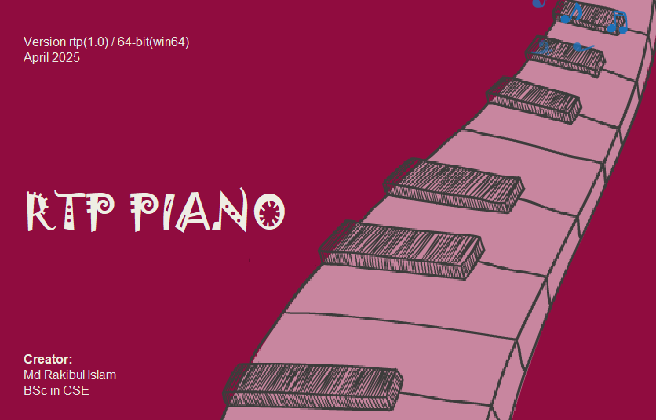
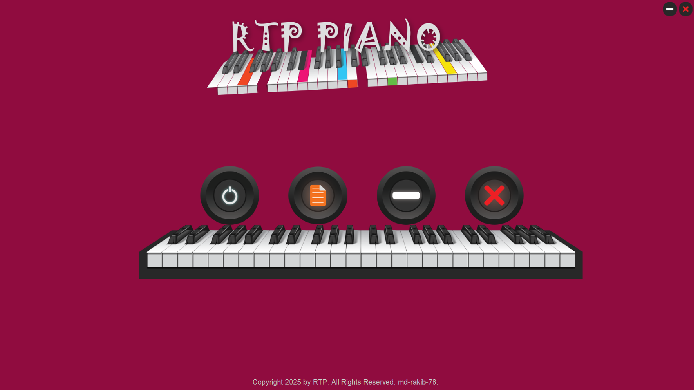
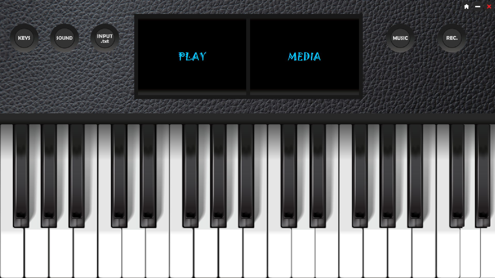
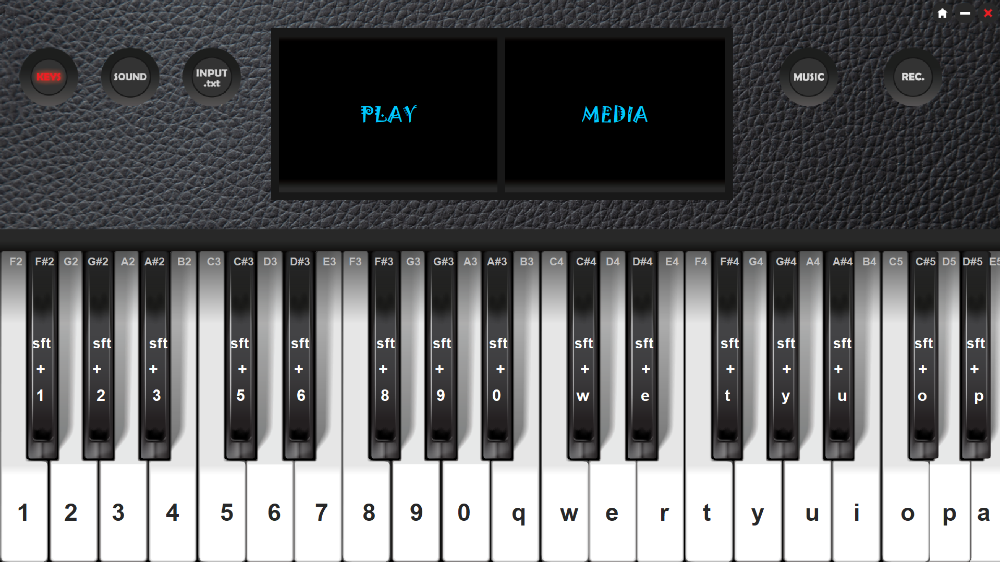
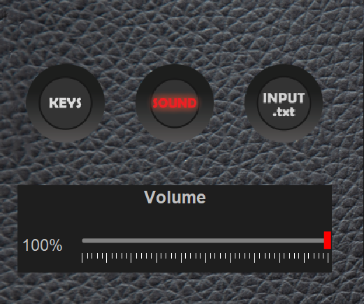
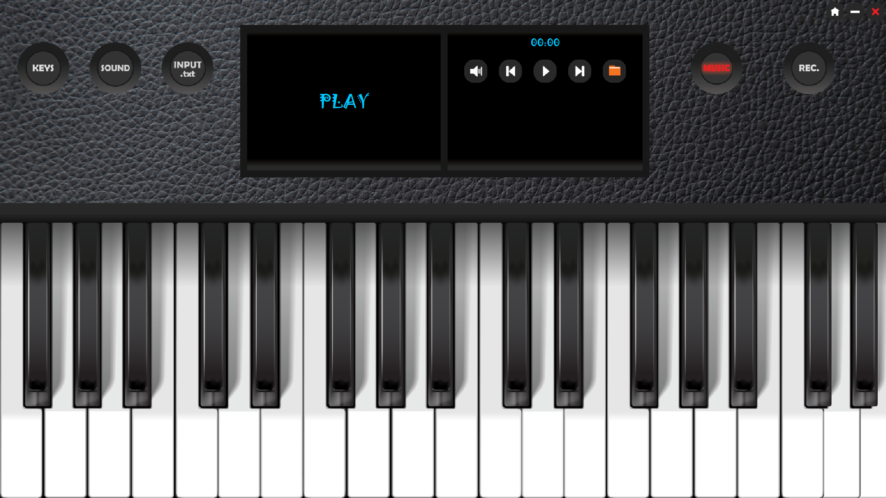
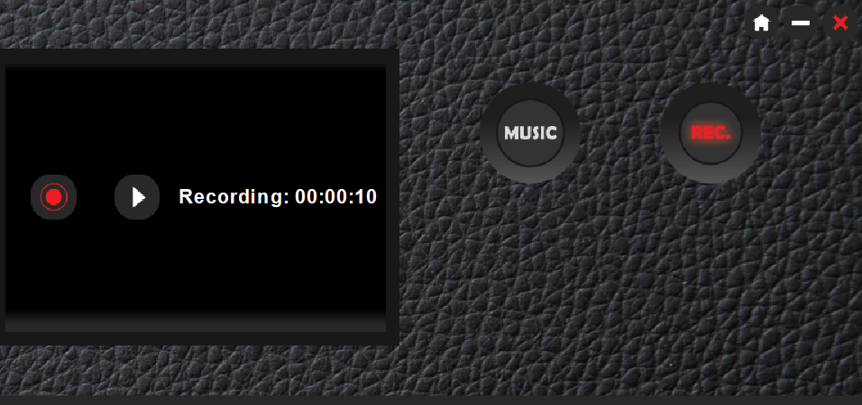

# RTP Piano — Virtual Piano Application

A feature-rich virtual piano desktop application built with **Java Swing**, offering an interactive piano board, AI-powered melody generation, audio recording, and a built-in music player.

---

## Features

-  **Interactive Piano Board** — Play piano notes across multiple octaves (F2 to E5) using on-screen buttons, with both natural keys and sharp (#) keys supported.
-  **AI Melody Generator** — Enter a prompt, choose an emotion and duration, and let the AI generate a realistic piano sequence for you using the Anthropic Claude API.
-  **Music Player** — Load and play your own MP3/audio files with play, pause, skip, volume control, and a track timer.
-  **Screen/Audio Recorder** — Record your piano sessions directly using FFmpeg (WASAPI-based), with pause/resume support and automatic file merging.
-  **Volume Control** — Adjustable volume slider for the piano sounds.
-  **Keyboard Shortcut Guide** — Visual overlay showing all key mappings for quick reference.
-  **Splash Screen** — Stylish loading screen on startup.
-  **About Page** — App info and creator details.
-  **Custom UI** — Fully custom-designed interface with gradient panels, icon buttons, and adaptive screen sizing.

---

## User Interface

1. Splash screen <br> 
2. Menu 
3. Piano Board 
4. Key Button 
5. Volume Button 
6. Music Button 
7. Recording Button 

##  Tech Stack

| Technology | Purpose |
|---|---|
| Java (Swing / AWT) | Core UI and application logic |
| Java Sound API | WAV audio playback for piano keys |
| BasicPlayer (javazoom) | MP3 music player support |
| FFmpeg 7.1.1 | Audio recording via WASAPI |
| Anthropic Claude API | AI piano sequence generation |
| Java HTTP Client | API communication |

---

##  Project Structure

```
vartual piano/
├── PianoBoard.java           # Main piano interface with all 40 keys
├── MusicPlayer.java          # MP3 music player (extends PianoBoard)
├── recording.java            # Audio recorder using FFmpeg
├── AI_prompt.java            # AI melody generator UI
├── PianoSequenceGenerator.java # Claude API integration
├── keysIndicator.java        # Keyboard shortcut overlay
├── home.java                 # Home/menu screen
├── Splash.java               # Splash screen
├── volume.java               # Volume control panel
├── about.java / about1.java  # About screens
├── inputFile.java            # File input handler
├── sound/
│   ├── Set 1/                # WAV files for natural keys (A0–G8)
│   └── Set 2 #/              # WAV/OGG files for sharp keys
├── image/                    # All UI assets and icons
├── jar file/                 # Required 3rd-party libraries
│   ├── basicplayer3.0.jar
│   ├── mp3spi-1.9.5.jar
│   ├── jl1.0.jar
│   ├── tritonus_mp3-0.3.6.jar
│   ├── tritonus_share.jar
│   └── commons-logging-1.2.jar
└── ffmpeg-7.1.1-essentials_build/
    └── bin/
        └── ffmpeg.exe        # Bundled FFmpeg for recording
```

---

## Requirements

- **Java JDK 11 or higher** (with `java.net.http` support)
- **Windows OS** (recording uses WASAPI — Windows Audio Session API)
- All required `.jar` libraries are included in the `jar file/` folder
- FFmpeg is bundled in the project — no separate installation needed

---

##  Piano Key Range

The piano covers **4 octaves** of keys:

```
F2  F#2  G2  G#2  A2  A#2  B2
C3  C#3  D3  D#3  E3  F3  F#3  G3  G#3  A3  A#3  B3
C4  C#4  D4  D#4  E4  F4  F#4  G4  G#4  A4  A#4  B4
C5  C#5  D5  D#5  E5
```

---

## Creator
**Md Rakibul Islam**  
BSc in Computer Science & Engineering  
Version: rtp(1.0) | 64-bit (win64) | April 2025

---

## License
This project is for educational and personal use. FFmpeg is included under its own [LGPL/GPL license](https://ffmpeg.org/legal.html).
